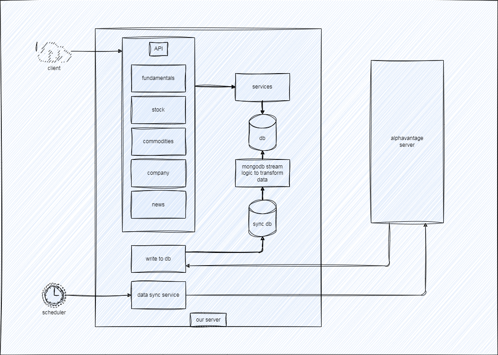

# alphavantage server

## 1. Project Overview

Use the scheduler capability of GitHub Action to periodically obtain data from the AlphaVantage server for the [react project](https://github.com/futugyou/react-project) to display charts.

## 2. Scheduler Description

This service will be called by GitHub Actions at 23:30 UTC every day and retrieve data from [alphavantage](www.alphavantage.co).

## 3. Design



## 4. Miscellaneous

```shell
go mod edit -replace github.com/futugyou/alphavantage=../alphavantage

go mod edit -replace github.com/futugyou/alphavantage=github.com/futugyou/goproject/alphavantage@master
go mod tidy
```
