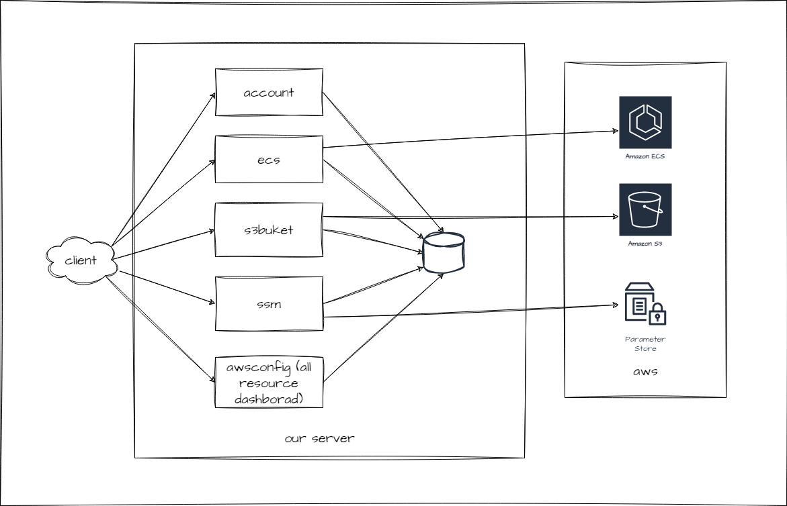
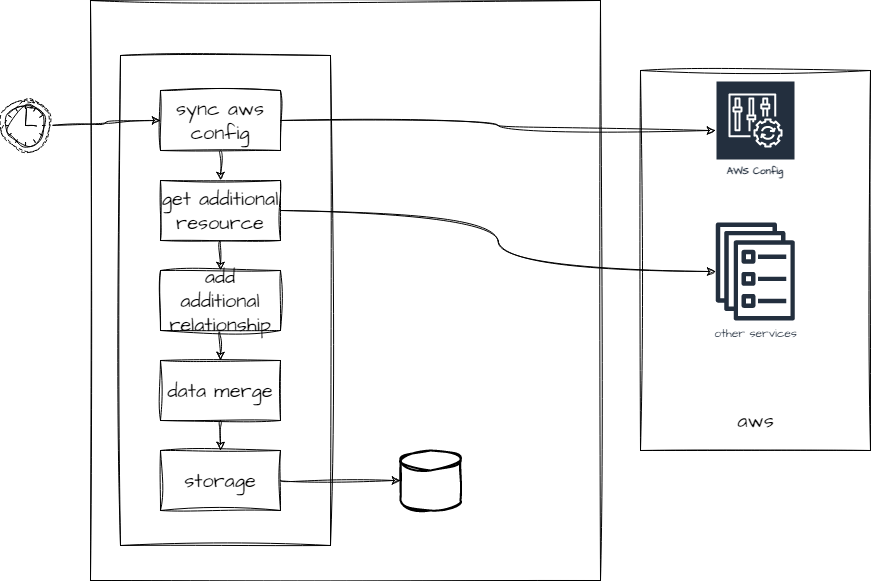

# aws server

## 1. Overview

This project provides a unified way to query and visualize information from various AWS services such as **SSM**, **ECS**, and **S3**.
While it supports multiple AWS data sources, its core functionality focuses on retrieving and analyzing data from **AWS Config**.

By leveraging **AWS Config**, the project enables a complete view of all resources within your AWS environment — including their **relationships and dependencies**.
These dependencies can be represented visually in the frontend as a **resource topology graph**, for example using the **Cytoscape.js** component.

Additionally, by integrating AWS billing data, the system can associate each resource with its **cost structure**, offering a clearer and more transparent understanding of resource utilization and expenses.

## 2. Design

- ### Resource without AWS Config

- ### AWS Config

## 3. Roadmap

- [ ] **AWS Billing Report** – Integrate AWS Cost and Usage Reports (CUR) to provide detailed cost insights for each resource.
- [ ] **Obtain More Resources** – Extend data collection to include additional AWS services (e.g., Lambda, RDS, CloudFront).
- [ ] **Incremental Resource Acquisition** – Implement incremental updates to avoid full data scans and improve efficiency.
